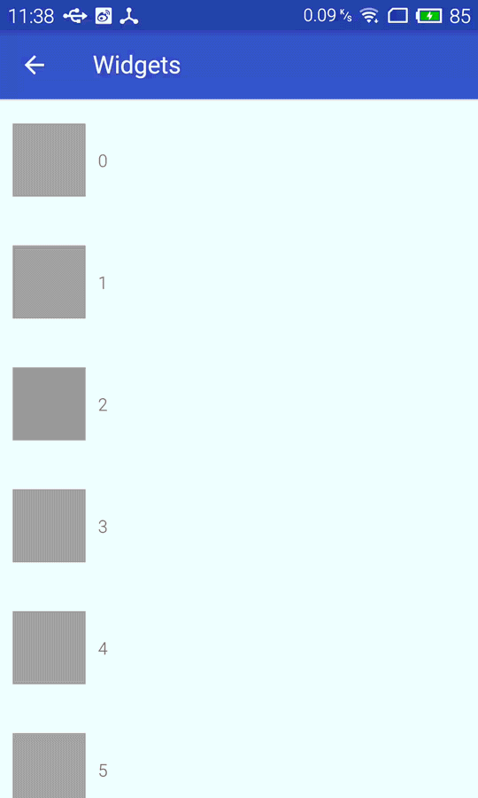
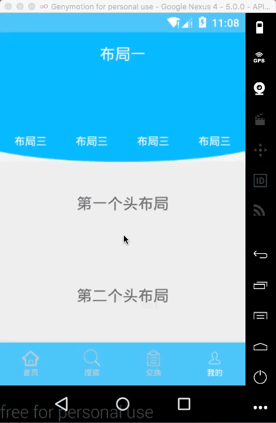

## 小控件，方法合集
---

#### Python脚本替换Android资源(包名,图片,文件内容)

* 详见： [Python4Android.md](./app/src/main/java/com/jinqiang/py4android/Python4Android.md)

---

#### Android引导页动画(RxJava)

> 最近在考虑用新的形式构建APP的欢迎页和引导页，发现一个不错的过渡动画，主要是图片的灰度和放大效果,进入后延迟一秒开始动画。
使用RxJava的Timer操作符实现延迟。

* 详见：[WelcomeActivity](./app/src/main/java/com/jinqiang/welcomebanner/WelcomeActivity.java)

---

#### H5引导页
> 前端的fullpage展示已经在非常多的站点上使用了，这里尝试将Android的引导页换成fullpage的网页动画，这里是示例图片，添加更多动画元素以后效果应该非常不错。

* 首先我替换了原生的webview控件，改成了腾讯x5的[webviewSDK](http://x5.tencent.com/)，低配的手机上加强了性能体验(虽然感觉冷启动过程好像长了点...)

* 在asserts文件夹中建立一个web项目文件夹，如`web_page`，然后用前端开发工具(我是用的sublime text3)实现fullpage引导页。

* Tencent webview调用本地HTML资源：

```
mWeb.loadUrl("file:///android_asset/web_page/page.html");
```

* 详见: [WebWelcomeActivity](./app/src/main/java/com/jinqiang/welcomebanner/WebWelcomeActivity.java)

---

#### Android MVP 实践

* 详见 [Android MVP.md](./app/src/main/java/com/jinqiang/MVPtest/MVP.md)

#### RecyclerView刷新控件及CoordinatorLayout合用实现

效果：




* 详见 [RecyclerView.md](./app/src/main/java/com/jinqiang/RecyclerViewRefresh/RecyclerView.md)

#### Material 登录注册界面效果

效果：


* 详见 [RecyclerView.md](./app/src/main/java/com/jinqiang/materialLogin/MaterialLogin.md)

#### BottomNavigationBar 底部导航栏

在MainActivity中添加了Material design风格的底部导航栏：[BottomNavigation](https://github.com/Ashok-Varma/BottomNavigation)
但是在引入过程中发现，单个tab点击的时候都有放大效果，这不符合我的设计风格，作者并没有添加控制点击动画的API，于是自己动手，下载源码开始修改。

* 首先我们在BottomNavigationBar类中发现初始化过程：

```java
   public void initialise() {
        mSelectedPosition = DEFAULT_SELECTED_POSITION;
        mBottomNavigationTabs.clear();

        if (!mBottomNavigationItems.isEmpty()) {
            mTabContainer.removeAllViews();
            if (mMode == MODE_DEFAULT) {
                if (mBottomNavigationItems.size() <= MIN_SIZE) {
                    mMode = MODE_FIXED;
                } else {
                    mMode = MODE_SHIFTING;
                }
            }
            if (mBackgroundStyle == BACKGROUND_STYLE_DEFAULT) {
                if (mMode == MODE_FIXED) {
                    mBackgroundStyle = BACKGROUND_STYLE_STATIC;
                } else {
                    mBackgroundStyle = BACKGROUND_STYLE_RIPPLE;
                }
            }

            if (mBackgroundStyle == BACKGROUND_STYLE_STATIC) {
                mBackgroundOverlay.setVisibility(View.GONE);
                mContainer.setBackgroundColor(mBackgroundColor);
            }

            int screenWidth = Utils.getScreenWidth(getContext());

            if (mMode == MODE_FIXED) {

                int[] widths = BottomNavigationHelper.getMeasurementsForFixedMode(getContext(), screenWidth, mBottomNavigationItems.size(), mScrollable);
                int itemWidth = widths[0];

                for (BottomNavigationItem currentItem : mBottomNavigationItems) {
                    FixedBottomNavigationTab bottomNavigationTab = new FixedBottomNavigationTab(getContext());
                    setUpTab(bottomNavigationTab, currentItem, itemWidth, itemWidth);
                }

            } else if (mMode == MODE_SHIFTING) {

                int[] widths = BottomNavigationHelper.getMeasurementsForShiftingMode(getContext(), screenWidth, mBottomNavigationItems.size(), mScrollable);

                int itemWidth = widths[0];
                int itemActiveWidth = widths[1];

                for (BottomNavigationItem currentItem : mBottomNavigationItems) {
                    ShiftingBottomNavigationTab bottomNavigationTab = new ShiftingBottomNavigationTab(getContext());
                    setUpTab(bottomNavigationTab, currentItem, itemWidth, itemActiveWidth);
                }
            }

            if (mBottomNavigationTabs.size() > mFirstSelectedPosition) {
                selectTabInternal(mFirstSelectedPosition, true, false, false);
            } else if (!mBottomNavigationTabs.isEmpty()) {
                selectTabInternal(0, true, false, false);
            }
        }
    }
```

`mMode`代表不同的点击效果，一般底部导航栏不超过3个时，都是`MODE_FIXED`模式，超过则为`MODE_SHIFTING`模式。我们希望修改`MODE_FIXED`模式下的点击动画，于是找到：

```java
    if (mMode == MODE_FIXED) {

        int[] widths = BottomNavigationHelper.getMeasurementsForFixedMode(getContext(), screenWidth, mBottomNavigationItems.size(), mScrollable);
        int itemWidth = widths[0];

        for (BottomNavigationItem currentItem : mBottomNavigationItems) {
            FixedBottomNavigationTab bottomNavigationTab = new FixedBottomNavigationTab(getContext());
            setUpTab(bottomNavigationTab, currentItem, itemWidth, itemWidth);
        }

    }
```

跟进`setUpTab`这个方法：

```java
/**
     * Internal method to setup tabs
     *
     * @param bottomNavigationTab Tab item
     * @param currentItem         data structure for tab item
     * @param itemWidth           tab item in-active width
     * @param itemActiveWidth     tab item active width
     */
    private void setUpTab(BottomNavigationTab bottomNavigationTab, BottomNavigationItem currentItem, int itemWidth, int itemActiveWidth) {
        bottomNavigationTab.setInactiveWidth(itemWidth);
        bottomNavigationTab.setActiveWidth(itemActiveWidth);
        bottomNavigationTab.setPosition(mBottomNavigationItems.indexOf(currentItem));
        bottomNavigationTab.setOnClickListener(new OnClickListener() {
            @Override
            public void onClick(View v) {
                BottomNavigationTab bottomNavigationTabView = (BottomNavigationTab) v;
                selectTabInternal(bottomNavigationTabView.getPosition(), false, true, false);
            }
        });

        mBottomNavigationTabs.add(bottomNavigationTab);

        BottomNavigationHelper.bindTabWithData(currentItem, bottomNavigationTab, this);

        bottomNavigationTab.initialise(mBackgroundStyle == BACKGROUND_STYLE_STATIC);

        mTabContainer.addView(bottomNavigationTab);
    }
```

发现底部图标和文字由`bottomNavigationTab`控制，跟进`bottomNavigationTab`发现可以设置item选中和非选中的状态，这正是我想要修改的：

```java
public void select(boolean setActiveColor, int animationDuration) {
        isActive = true;
            ValueAnimator animator = ValueAnimator.ofInt(containerView.getPaddingTop(), paddingTopActive);
            animator.addUpdateListener(new ValueAnimator.AnimatorUpdateListener() {
                @Override
                public void onAnimationUpdate(ValueAnimator valueAnimator) {
                    containerView.setPadding(containerView.getPaddingLeft(),
                            (Integer) valueAnimator.getAnimatedValue(),
                            containerView.getPaddingRight(),
                            containerView.getPaddingBottom());
                }
            });
            animator.setDuration(animationDuration);
            animator.start();

        iconView.setSelected(true);
        if (setActiveColor) {
            labelView.setTextColor(mActiveColor);
        } else {
            labelView.setTextColor(mBackgroundColor);
        }

        if (badgeItem != null) {
            badgeItem.select();
        }
    }
```

也就是说我们给这个属性动画加上一个控制就可以了，那应该在BottomNavigationBar设置的时候传入进来，于是我在BottomNavigationBar加入了mIconAnimation变量。

```java
 private void setUpTab(BottomNavigationTab bottomNavigationTab, BottomNavigationItem currentItem, int itemWidth, int itemActiveWidth) {
        bottomNavigationTab.setInactiveWidth(itemWidth);
        bottomNavigationTab.setActiveWidth(itemActiveWidth);
        bottomNavigationTab.setPosition(mBottomNavigationItems.indexOf(currentItem));
        /** modified here **/
        if (mMode != MODE_SHIFTING)
            bottomNavigationTab.setIconAnimation(mIconAnimation);//1111
        bottomNavigationTab.setTextSize(mLabelTextSize);//1111
        bottomNavigationTab.setOnClickListener(new OnClickListener() {
            @Override
            public void onClick(View v) {
                BottomNavigationTab bottomNavigationTabView = (BottomNavigationTab) v;
                selectTabInternal(bottomNavigationTabView.getPosition(), false, true, false);
            }
        });

        mBottomNavigationTabs.add(bottomNavigationTab);

        BottomNavigationHelper.bindTabWithData(currentItem, bottomNavigationTab, this);

        bottomNavigationTab.initialise(mBackgroundStyle == BACKGROUND_STYLE_STATIC);

        mTabContainer.addView(bottomNavigationTab);
    }
```

`BottomNavigationTab`中在动画部分添加一个判断控制即可。

#### React-native 相关实践


详见 **Home3Fragment**,**react-src**


---


#### Android CollapsingToolbarLayout 和ToolBar多种实践



详见 [Home4fragment](./app/src/main/java/com/jinqiang/fragments/Home4Fragment)

---